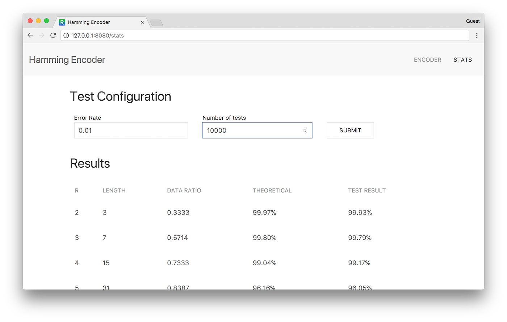

# Hamming Code Web App

An implementation of Hamming codes using Python and NumPy, packaged into a web application with Flask. 


This application was written for CS3302 Data Encoding at the University of St Andrews (2017). Available online at <https://rminami.pythonanywhere.com/> (if I haven't forgotten to keep it online).

## Installation

To run the application locally on your machine, first download it with 

```
$ git clone https://github.com/ryosukeminami/hamming-code-app.git
$ cd hamming-code-app/
```

It is recommended that you set up a virtual environment for this application. After making sure [virtualenv](https://virtualenv.pypa.io/) is installed, run

```
$ virtualenv venv
$ source venv/bin/activate
$ pip3 install -r requirements.txt
```

Now that all of the dependencies have been installed, run the application with

```
$ cd hamming_app/
$ python3 flask_app.py
```

Enjoy!

## Usage

The user interface should be fairly self explanatory. Type a binary number into the 'binary input' text box and see how Hamming codes handle it. Additionally, you can click the random button to generate a random binary number. 


The stats window shows how the metrics change with different values of r. As r grows larger, the data ratio improves, but the checkers' ability to correct errors decreases. The user can also test various error rates to see if the test results match up with the expected success rates. 



## License

MIT License (c) 2017 Ryosuke Minami. Details are in the [`LICENSE`](./LICENSE) file.
